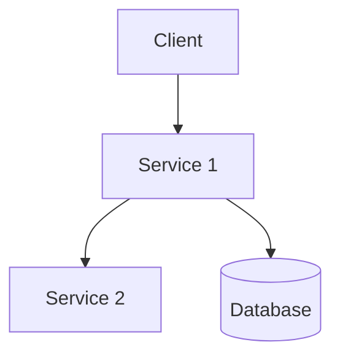

# Backend SPEC-NNNN: Title

<!--
Backend SPEC Template for Superr
For backend architecture proposals involving Golang services, Cloud Run, GCS, etc.
-->

## Metadata

| Field             | Value                                              |
| ----------------- | -------------------------------------------------- |
| SPEC Number       | NNNN (To be assigned)                              |
| Title             | Title of the Enhancement                           |
| Authors           | [@github-handle](https://github.com/github-handle) |
| Status            | Proposed / Accepted / Implemented / Deferred       |
| Creation Date     | YYYY-MM-DD                                         |
| Last Updated      | YYYY-MM-DD                                         |
| Target Release    | vX.Y                                               |
| Affected Services | service-name-1, service-name-2                     |
| Dependencies      | SPEC-XXXX, SPEC-YYYY (if applicable)               |

## Summary

<!--
A concise (1-2 paragraph) description of the proposed enhancement.
Explain the goal and the solution at a high level.
-->

## Motivation

<!--
Why are we doing this? What user/business problems does it solve?
What are the benefits of implementing this enhancement?
-->

### Goals

<!--
List the specific goals of the SPEC.
Make these measurable when possible.
-->

### Non-Goals

<!--
What is out of scope for this SPEC?
Helps to focus discussion and prevent scope creep.
-->

## Technical Design

### System Architecture

<!--
Describe how this fits into the current system architecture.
Include diagrams when possible (mermaid or draw.io recommended).
-->

### API Changes

<!--
If your proposal modifies APIs, describe the changes:
- New endpoints
- Modified request/response structures
- Deprecated endpoints
Include examples in Go code or API specs.
-->

### Database Changes

<!--
Describe any changes to data models, storage, or persistence.
Include schema changes if applicable.
-->

### Infrastructure Changes

<!--
Describe changes to:
- Cloud Run service configurations
- GCS bucket setup
- Networking/firewall rules
- IAM permissions
-->

### Error Handling

<!--
How will errors be handled?
Does this impact our Sentry integration?
-->

## Implementation Details

### Dependencies

<!--
List any new libraries, services, or external dependencies.
Justify any major new dependencies.
-->

### Performance Considerations

<!--
How will this impact performance?
Include considerations for:
- API response times
- Resource utilization (memory, CPU)
- Cost implications
-->

### Scalability

<!--
How will this solution scale with increased load?
Consider:
- Cloud Run instance scaling
- Database load
- Storage requirements
-->

## Security Considerations

<!--
Describe security implications and mitigations:
- Authentication/authorization changes
- Data security and privacy
- Input validation
- OWASP top 10 mitigations
-->

## Testing Strategy

<!--
How will this be tested?
Include:
- Unit testing approach
- Integration testing
- Load/performance testing if relevant
-->

## Observability

<!--
How will we monitor this change?
- Logs
- Metrics
- Sentry error tracking
- Alerts
-->

## Rollout Plan

<!--
How will this be deployed?
Include:
- Phased rollout strategy
- Feature flagging approach (if applicable)
- Rollback plan
-->

## Alternatives Considered

<!--
What other approaches were considered and why weren't they used?
-->

## Questions and Concerns

<!--
List any open questions or concerns that need resolution.
-->

## References

<!--
List any references, documentation, or related work.
-->
