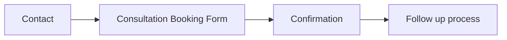
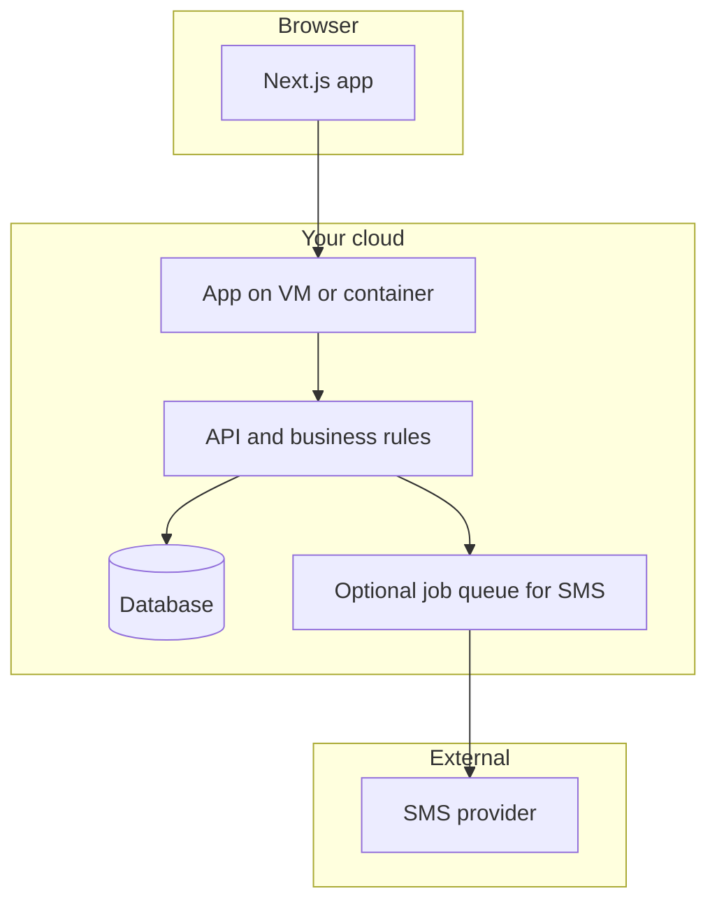

# Appointment booking website — planning document

## What is already decided (from your answers)

| Area | Your choice |
|------|-------------|
| **Wireframe** | **Received (client):** full site tree below (HOME + nested sections + Appointment flow). Field-level booking form spec still TBD. |
| **Domain** | Healthcare / clinic |
| **Users (MVP scope)** | Public visitors browse and book; **single location for MVP**; **multi-location later** (not in first release). |
| **Auth** | **Guest-only** booking (e.g. name, phone, email as needed)—no user accounts. |
| **Payments** | **Out of scope** for the current phase. |
| **Notifications** | **SMS** (email/push not selected). |
| **Frontend** | **Next.js / React**. |
| **Backend / API** | **FastAPI** (Python)—REST (and optional future WebSocket); serves booking, availability, SMS triggers, and future admin APIs. **Database/ORM** to confirm (PostgreSQL + SQLAlchemy is the usual pairing). |
| **Language / UI** | **English only** (LTR). |
| **Hosting** | **Cloud VM** (AWS / GCP / Azure or similar—you did not pick a vendor). |
| **Compliance framing** | **India-focused** (DPDP-style mindset: consent, purpose limitation, retention, security). Formal legal sign-off is outside engineering scope but the plan calls out engineering-aligned practices. |
| **Operations / admin** | **Undecided**—compare options (simple admin UI vs super-admin only vs config-only vs CMS). |
| **Visual / imagery** | **Client wants more images** across the site; **reference homepage UI** (screenshots below) defines layout, palette, and typography direction. |
| **Navigation labels** | **Use written wireframe naming** for menus and pages; reference screenshots are **visual-only** (do not copy shorter labels like “Treatments” if they conflict with the approved IA). |

## Fonts in this repo

- [`fonts/fonts.css`](c:\Users\TECQNIO\Desktop\Soukhya-bharathi\fonts\fonts.css) defines **mayo-display**, **mayo-sans**, **mayo-serif** from remote URLs.
- [`fonts/mayo-clinic-fonts-arabic.css`](c:\Users\TECQNIO\Desktop\Soukhya-bharathi\fonts\mayo-clinic-fonts-arabic.css) adds **Tajawal** (Arabic); you chose **English only**, so Arabic may stay unused unless you later add RTL.
- **Action later (not decided here):** Confirm **font licensing** for production (third-party CDN vs self-hosted `.woff2` in repo). The plan assumes you will **wire these `@font-face` rules into the Next.js app** (e.g. global CSS or `next/font` if you switch to local files).

## Visual design reference (client homepage UI)

**Purpose:** Your **simple UI reference** (homepage screenshots) is the baseline for **layout, spacing, and component patterns**. The client’s ask—**more images**—means expanding **photography and illustration** while keeping this look: **clean white surfaces, teal accents, generous whitespace, card grids with image tops.**

### Reference screenshots (saved for implementation)

Six PNG references are stored under the Cursor project assets folder (copy into the repo `public/images/` or similar when building):

- [`assets/c__Users_TECQNIO_AppData_Roaming_Cursor_User_workspaceStorage_1f3746693a4f950da8795840b70dafdb_images_image-7f353ce1-30d3-4129-a6c7-16297d49b268.png`](c:\Users\TECQNIO\.cursor\projects\c-Users-TECQNIO-Desktop-Soukhya-bharathi\assets\c__Users_TECQNIO_AppData_Roaming_Cursor_User_workspaceStorage_1f3746693a4f950da8795840b70dafdb_images_image-7f353ce1-30d3-4129-a6c7-16297d49b268.png)
- [`assets/c__Users_TECQNIO_AppData_Roaming_Cursor_User_workspaceStorage_1f3746693a4f950da8795840b70dafdb_images_image-660cfeda-54c4-423c-ad15-c28ca47402fb.png`](c:\Users\TECQNIO\.cursor\projects\c-Users-TECQNIO-Desktop-Soukhya-bharathi\assets\c__Users_TECQNIO_AppData_Roaming_Cursor_User_workspaceStorage_1f3746693a4f950da8795840b70dafdb_images_image-660cfeda-54c4-423c-ad15-c28ca47402fb.png)
- [`assets/c__Users_TECQNIO_AppData_Roaming_Cursor_User_workspaceStorage_1f3746693a4f950da8795840b70dafdb_images_image-98564e20-a5ed-4381-b7dc-d1d1a075534b.png`](c:\Users\TECQNIO\.cursor\projects\c-Users-TECQNIO-Desktop-Soukhya-bharathi\assets\c__Users_TECQNIO_AppData_Roaming_Cursor_User_workspaceStorage_1f3746693a4f950da8795840b70dafdb_images_image-98564e20-a5ed-4381-b7dc-d1d1a075534b.png)
- [`assets/c__Users_TECQNIO_AppData_Roaming_Cursor_User_workspaceStorage_1f3746693a4f950da8795840b70dafdb_images_image-89ac78ed-156b-4945-8755-9bb19223d16b.png`](c:\Users\TECQNIO\.cursor\projects\c-Users-TECQNIO-Desktop-Soukhya-bharathi\assets\c__Users_TECQNIO_AppData_Roaming_Cursor_User_workspaceStorage_1f3746693a4f950da8795840b70dafdb_images_image-89ac78ed-156b-4945-8755-9bb19223d16b.png)
- [`assets/c__Users_TECQNIO_AppData_Roaming_Cursor_User_workspaceStorage_1f3746693a4f950da8795840b70dafdb_images_image-09ca44f3-3b2c-45b1-a250-b03035ccd1bf.png`](c:\Users\TECQNIO\.cursor\projects\c-Users-TECQNIO-Desktop-Soukhya-bharathi\assets\c__Users_TECQNIO_AppData_Roaming_Cursor_User_workspaceStorage_1f3746693a4f950da8795840b70dafdb_images_image-09ca44f3-3b2c-45b1-a250-b03035ccd1bf.png)
- [`assets/c__Users_TECQNIO_AppData_Roaming_Cursor_User_workspaceStorage_1f3746693a4f950da8795840b70dafdb_images_image-a89dd50a-1073-46b6-8367-761acc038e7f.png`](c:\Users\TECQNIO\.cursor\projects\c-Users-TECQNIO-Desktop-Soukhya-bharathi\assets\c__Users_TECQNIO_AppData_Roaming_Cursor_User_workspaceStorage_1f3746693a4f950da8795840b70dafdb_images_image-a89dd50a-1073-46b6-8367-761acc038e7f.png)

*(Paths are under `.cursor/projects/.../assets/`; duplicate into the Soukhya-bharathi repo for version control.)*

### Patterns to replicate (from reference)

- **Header:** Logo (teal mark + “Soukhya Bharathi” in serif), **centered nav**, primary **“Book Appointment”** CTA (rounded teal button, white label).
- **Hero:** Full-width **facility or lifestyle photo** with **dark teal overlay** for contrast; eyebrow line, large **serif headline**, supporting sans body; dual CTAs (e.g. “Start Your Journey”, “Book Consultation”).
- **Section: “Care @ SaukhyaBharathi”:** Centered title + subtitle; **three large vertical cards** with **strong photography**, title, short description; third card can route to booking.
- **Section: “Ayurveda & Wellness Treatments”:** Three image-forward cards (e.g. Panchakarma, Acupuncture, “All Treatment Details”) with **rounded image tops** and serif titles.
- **Further down:** Treatment detail cards with “View Details →”; **Research & Education + Success Stories** row with **facility / portrait / patient-stories** imagery; **Testimonials** with rating line and quote cards; **footer** on solid teal with columns (brand blurb, quick links, treatments list, visit/contact).

### Design tokens (approximate — finalize in CSS variables)

| Token | Reference |
|-------|-----------|
| **Primary teal** | ~`#268b8b`–`#2A8E87` (pick one hex for consistency) |
| **Page background** | `#FFFFFF` |
| **Text** | Near-black headings (serif), grey nav/body (sans) |
| **Cards** | White, light shadow, ~12–16px radius |
| **Typography** | **Serif** for logo, H1–H2, card titles; **sans** for nav, buttons, body (align with [`fonts/fonts.css`](c:\Users\TECQNIO\Desktop\Soukhya-bharathi\fonts\fonts.css) families). |

### Image strategy (“more images” — client request)

| Placement | Role |
|-----------|------|
| **Hero + key sections** | One strong **location** shot per major scroll region; keep overlay where text sits on photos. |
| **Care / program cards** | **Authentic treatment or clinical context** photos (consent for identifiable patients if any). |
| **Specialty hubs** (from written IA) | **Banner or side image** per pillar (oncology, neuro, etc.) to avoid walls of text. |
| **Research & Success** | Facility, **team portraits**, **patient story** stills or video thumbnails (placeholder until real assets). |
| **Testimonials** | Optional **avatar** or neutral icon if no photo; stars remain. |
| **Appointment flow** | Calm **waiting-area or consultation** imagery on non-form steps; no clutter on form screens. |

**Engineering:** Use **`next/image`** with explicit **width/height** or `fill`, **lazy loading** below fold, **WebP/AVIF** where possible, and **descriptive `alt` text** (accessibility + SEO). **Performance budget:** avoid huge unoptimized PNGs on mobile.

**Governance:** Client/legal should approve **model releases** for patient imagery and **accuracy** of clinical photography. No stock that contradicts brand.

### Navigation labels (reconcile with written IA)

**Decision:** **Prioritize the written wireframe** for nav and page titles (e.g. wellness pillar wording from the client tree). The PNG reference remains the **visual pattern** (header layout, teal CTA, card grids, imagery)—if space is tight, use **truncation, two-line labels, or a “More” menu** rather than renaming IA without client approval.

## Client wireframe (information architecture)

**Source:** client-provided written wireframe for Soukhya Bharathi (SBH). This drives **navigation and page inventory**; implementation can use flat routes, nested layouts, or a CMS—**not decided here**.

**Scope note:** The site is a **full hospital/marketing presence** (many specialty and program pages) **plus** a dedicated **Appointment** area. Booking is one branch of a large tree.

### Site tree (as given)

- **HOME**
- **Care @ Soukhya Bharathi**
  - **Ayurveda & Modern Medicine Under Single Roof**
    - Integrated and Cooperative Healthcare Approach
  - **Cancer care and Surgical Oncology** — oncology super specialty care; Ayurveda Oncology; Surgery; Chemotherapy; Radiotherapy; Counseling
  - **Neurological Care** — Stroke/Paralysis; Spine alignment; Developmental disorders; Comprehensive Care for management of Autism Spectrum Disorders; Dementia; Alzheimer’s Disease; Parkinson’s Disease; Epilepsy and Seizure Disorders; Migranie; Sciatica
  - **Cardiac Care** — Preventive Cardiology; Hypertension
  - **Respiratory Care** — Interstitial Lung Disease; Pneumonia; Bronchitis / Bronchial Asthma; Sinusitis
  - **Women’s Care** — PCOD; Menorrhagia/Dysmenorrhea; Infertility; Menopausal Care; Pre-Pregnancy Planning (Garbha Samskara); Antenatal/Postnatal care; Pregnancy Care; Endometriosis
  - **Pediatric Care** — Autism; ADHS; Developmental Delay; Allergy/Asthma; Skin Disorders; Tonsil and Adenoid Care
  - **Skin and Hair Care** — Acne; Psoriasis; Vitiligo; Eczema; Fungal Infections; Hair Fall and Premature Graying of Hair
  - **Digestive Care** — Acute/Chronic Gastritis; Dyspepsia; IBS; IBD (Crohn’s / Ulcerative Colitis); Malabsorption and nutritional deficiency; Fatty Liver
  - **Endocrinology Care** — Type 1 and Type 2 Diabetes; Thyroid Dysfunction; PCOD/PCOS
  - **Musculoskeletal Care** — Osteoarthritis; Rheumatoid Arthritis; Frozen Shoulder; Vertebral Disc Herniation; Ligament injury / Sprains
  - **Other Services** — Sleep Disorders; Male Infertility; Autoimmune Disorders; Home Panchkarma Services; In-Patient Services for Critical Conditions; Surgical Care
- **Ayurveda & Traditional Health Systems for Wellness**
  - **Therapies and Treatments** — Panchakarma; Acupuncture; Cupping Therapy; Yoga Therapy; Kalari Marma Therapy
  - **Integrated and cooperative Healthcare** — Benefits; Process; FAQs
- **Research & Education**
  - **Clinical Ethics Committee** — Data Safety Monitoring Board; Institutional Ethics Committee; Research Highlights
  - **Publications**
  - **Education Programs** — Continuing Medical Education and Training Programs; Ayurveda Oncology Clinical Internship and Training; Thesis and Project Guidance and Assistance; Technical Assistance for Protocol development, Case Documentation and Report Publication; Expert Guidance in preparation of Heavy metal and herbomineral based therapeutics; Quality control of heavy metal and herbomineral based drugs with Material Safety Data Sheet
- **About SBH** — Philosophy; Mission; Values; Team
- **Success Stories** — Video Testimonials; Reviews
- **Appointment**
  - Contact
  - Consultation Booking Form
  - Confirmation
  - Follow up process

**Copy/clinical accuracy:** Preserve client wording on public pages unless clinical/legal review requests changes (e.g. wireframe typos like “ADHS,” “Migranie” may be corrected after sign-off).

### Proposed route map (illustrative — confirm with stakeholders)

Not a commitment; aligns the wireframe to **Next.js App Router** patterns. Adjust slugs for SEO.

| Wireframe area | Example routes |
|----------------|----------------|
| Home | `/` |
| Care (pillar + specialties) | `/care`, `/care/[specialty]` or `/care/cancer-care`, etc.; sub-conditions as anchors or child routes `/care/neurological-care/stroke` |
| Wellness pillar | `/wellness`, `/wellness/therapies/[therapy]`, `/wellness/integrated-healthcare/[page]` |
| Research & Education | `/research`, `/research/ethics`, `/research/publications`, `/research/education`, nested program pages |
| About SBH | `/about`, `/about/[slug]` |
| Success Stories | `/success-stories`, `/success-stories/video`, `/success-stories/reviews` |
| Appointment | `/appointment` (hub), `/appointment/contact`, `/appointment/book` (consultation form), `/appointment/confirmation`, `/appointment/follow-up` |

**Locations:** **MVP = single branch** in product logic and copy. **Multi-location** is **phase 2**; schema may keep optional `location_id` for migration when backend is chosen.

### Appointment flow (from wireframe)

Client order: **Contact → Consultation Booking Form → Confirmation → Follow up process.**

**Booking mechanics (confirmed):** Users **pick date/time (or provider) online** with **live availability** (slot-based booking), then **Confirmation** and **Follow up process** as in the wireframe. Flow implies: navigate to booking → **select service/specialty (if required)** → **choose slot** → **guest details** on consultation form → confirm → SMS per earlier requirements. Exact step order can match UI wireframes when designed.

**Deferred:** **Multi-location** UX and data (single branch for MVP).

### Content strategy (planning)

- **Many leaf topics** (individual conditions) can be **MDX/markdown**, **headless CMS**, or **static TS config**—tie to admin decision.
- Shared layout: specialty hub pages with consistent blocks (intro, bullets, CTA to Appointment).

## Functional scope (MVP vs later)

**In scope for “current phase” (as stated):**

- **Single location (MVP);** multi-location later.
- **Live availability** and **time-slot selection** online (confirmed); rules depend on admin model (who defines calendars).
- Guest capture of contact details and booking metadata you define in the wireframe.
- SMS for key events (e.g. confirmation, reminder—**templates and timing** to confirm with you and with SMS provider policy).
- No payment integration.

**Explicitly deferred:**

- User accounts, staff self-service (unless you change scope when admin approach is chosen).
- Online payments.

**Open (you chose “admin undecided”):**

- **Who** creates/updates locations, services, provider calendars, holidays, and cancellations?
- Without this, engineering cannot finalize DB schema and APIs beyond a thin “demo” dataset.

**Admin / operations options to decide (no default chosen):**

1. **Simple admin web app** (authenticated): internal users manage locations, services, slots, blockouts.
2. **Single super-admin only**: one role, no per-staff login.
3. **No admin UI (MVP):** seed data via migrations/scripts; slow for real operations.
4. **Headless CMS:** content and sometimes structured data edited outside the app; booking engine still needs a source of truth for availability.

**Recommendation for planning only:** list **must-have operational tasks** (e.g. “block doctor vacation,” “add new branch”) and pick the smallest option that satisfies them—often **(1) or (2)** for real clinics.

## Backend architecture (FastAPI — decided)

**Choice:** **FastAPI** for the application API layer.

**Fits your requirements:**

- **OpenAPI / Swagger** generated for contract review and optional **frontend client codegen**.
- **Async** I/O suits database and HTTP calls to **SMS providers** without blocking workers.
- **Python ecosystem** for date/time, validation (Pydantic), and future scripting (migrations, admin tooling).

**Suggested default stack (confirm before build):**

| Layer | Recommendation |
|-------|----------------|
| **Framework** | FastAPI + Uvicorn (production: Uvicorn workers or Gunicorn + Uvicorn workers) |
| **Database** | **PostgreSQL** (managed on same cloud as VM where possible) |
| **ORM / migrations** | SQLAlchemy 2.x + Alembic |
| **Auth (future admin)** | JWT or session-based routes scoped to staff only—guest booking stays public with rate limits |
| **SMS** | Call provider from API route after successful booking; for **reminders**, use **background jobs** (Celery + Redis, ARQ, RQ, or a small worker process)—avoid losing SMS if the request thread dies |
| **CORS** | Allow only your **Next.js origin(s)** in production |

**Still to confirm (not the framework):**

- **Data residency:** region for Postgres and VM (India vs global provider region—align with DPDP posture).
- **Locations:** MVP single branch; optional `location_id` in schema for phase 2.
- **Deployment:** Docker Compose or separate processes on the VM—**Next.js** (Node) and **FastAPI** behind **Nginx/Caddy** reverse proxy with TLS.

**Deferred alternatives:** BaaS-only backend is **out** unless you later add sync from Supabase; third-party scheduling APIs could still wrap inside FastAPI if you ever integrate one.

## High-level system sketch (conceptual)

- **Next.js** can be **SSR/SSG** for marketing pages and **client components** for booking steps; API routes or a separate backend depends on your backend choice.

## India-focused data protection (engineering-oriented)

Not legal advice. Typical engineering measures to **discuss with counsel** for Indian requirements:

- **Consent:** clear notice at data collection (what you collect, why, retention).
- **Minimization:** collect only fields your workflow needs (wireframe will drive this).
- **Security:** TLS in transit, encryption at rest for DB where offered, access control for any admin, logging without unnecessary PHI in plain text.
- **SMS:** choose a provider that supports **India** routes; document subprocessors; align message content with policy (avoid sensitive clinical detail in SMS if possible).
- **Retention:** define how long guest and appointment records are kept and how deletion requests are handled.

## SMS (scope you selected)

- **Provider:** not chosen (e.g. Twilio, AWS SNS, MSG91, Gupshup—depends on India delivery and your account).
- **Events:** at minimum booking confirmation; optionally reminders (24h / 1h)—**you** decide and wireframe may show user expectations.
- **Implementation:** server-triggered only (never expose API keys in the browser).

## Hosting on a cloud VM (your choice)

- **Reverse proxy** (e.g. Nginx/Caddy) with TLS certificates.
- **Process manager** or **Docker Compose** for Next.js + API + worker (if separate).
- **Managed database** recommended instead of SQLite on VM for production.
- **Backups and monitoring** (health checks, log aggregation)—scope with your ops capacity.

## Testing and quality (plan-level)

- **Unit/integration tests** for booking conflicts (double-booking prevention), timezone handling, and location scoping.
- **E2E tests** for the main happy path after wireframe is fixed.
- **Load testing** optional for launch traffic.

## Documentation deliverables (suggested)

After stack and booking-mechanics decisions:

1. **Information architecture** (URLs and screens)—**draft started** from client wireframe above; finalize slugs and CMS vs static.
2. **Data model** (locations, services, slots, appointments, audit log)—**depends** on online scheduling vs request-only flow.
3. **API or server actions** contract.
4. **SMS templates** and triggers.
5. **Deployment runbook** for chosen cloud VM pattern.

## Immediate next steps (for you)

1. **Consultation Booking Form fields:** name, phone, email?, specialty/department, **slot already chosen** vs free text, consent checkbox—finalize list for legal/SMS copy.
2. **Decide admin/operations model** (even roughly): who maintains large content set and provider calendars/slots.
3. **Pick backend direction** (BaaS vs custom vs hybrid) when ready.
4. **Confirm SMS provider** and whether reminders are in MVP.
5. **Phase 2:** multi-location IA and `location_id` rollout when branches go live.

---

The client wireframe is **integrated** above. The plan still **does not** choose backend or admin implementation until you confirm **booking mechanics**, **form fields**, and **operations**. The next tightening step is an implementation backlog (epics, routes, schemas) after those answers.
