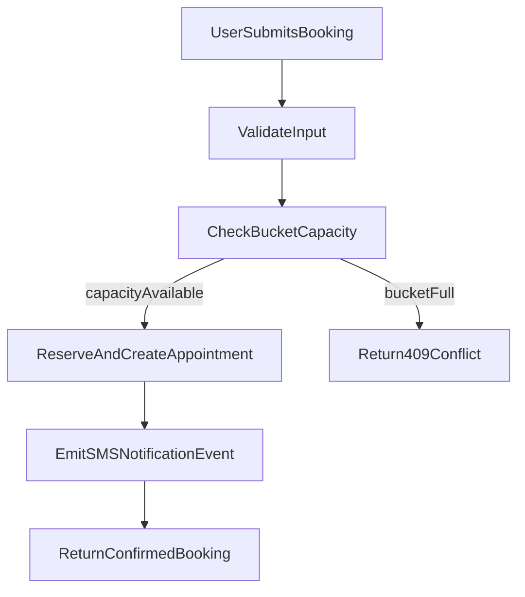

# SBH Backend PRD (Detailed)

## 1) Product Context and Scope

### Problem Statement
Soukhya Bharathi has a complete frontend appointment journey but does not yet have a production booking backend that validates requests, checks live capacity, confirms appointments, and triggers notifications.

### MVP Goals
- Accept guest booking requests from the appointment UI.
- Validate request payloads with consistent backend rules.
- Confirm appointment instantly when bucket capacity is available.
- Return a booking reference and canonical booking data for confirmation screens.
- Trigger an SMS confirmation event with auditable status.

### Non-Goals (MVP)
- Online payments.
- Patient login/account management.
- Multi-location scheduling logic (single location only).
- Doctor-specific exact-slot scheduling.
- Complex staff/admin RBAC.

### Users
- **Primary user:** public guest user booking consultation.
- **Operational user (later phase):** internal staff viewing/updating appointments.

### Success Criteria
- >= 99% valid booking submissions receive a deterministic API response (< 2 seconds p95).
- Double-booking conflicts are prevented at database transaction level.
- SMS confirmation event is recorded for every successful booking.

## 2) User Journey and Lifecycle

### Frontend-to-Backend Journey
1. User selects service, date, and time bucket (`morning`, `afternoon`, `evening`).
2. User enters patient details and submits booking.
3. Backend validates payload and checks bucket capacity atomically.
4. If capacity exists, backend creates booking with `confirmed` status.
5. Backend triggers SMS notification event.
6. Frontend receives booking reference and renders confirmation state.



### Appointment State Lifecycle (MVP)
- `confirmed`: booking created and capacity reserved.
- `cancelled`: booking cancelled manually (policy-driven).

### Deferred States
- `rescheduled`, `no_show`, `completed` reserved for future workflows.

## 3) Domain Model and Data Contract

## 3.1 Entities

### Service
- Canonical service catalog used by frontend selection.
- Example fields:
  - `id` (UUID or stable slug)
  - `code` (unique, immutable)
  - `name`
  - `group` (`specialty` or `wellness`)
  - `is_active`

### DailyBucketCapacity
- Capacity tracker per service/day/time bucket.
- Example fields:
  - `id`
  - `service_id`
  - `appointment_date` (date)
  - `time_bucket` (`morning|afternoon|evening`)
  - `max_capacity` (int > 0)
  - `used_capacity` (int >= 0)
  - `version` (int, optional optimistic lock)
  - unique key: `(service_id, appointment_date, time_bucket)`

### Appointment
- Core booking record.
- Example fields:
  - `id` (UUID)
  - `booking_reference` (human-friendly unique reference, e.g. `SBH-20260410-8F3A`)
  - `service_id`
  - `appointment_date`
  - `time_bucket`
  - `status` (`confirmed|cancelled`)
  - `name`
  - `phone`
  - `age`
  - `gender`
  - `concern` (nullable)
  - `consent_accepted` (bool)
  - `source` (e.g. `web`)
  - `idempotency_key` (nullable but recommended)
  - `created_at`, `updated_at`

### NotificationEvent
- SMS audit for observability and retries.
- Example fields:
  - `id`
  - `appointment_id`
  - `provider`
  - `template_id`
  - `status` (`queued|sent|delivered|failed`)
  - `provider_message_id` (nullable)
  - `request_payload` (redacted)
  - `response_payload` (redacted)
  - `error_code` (nullable)
  - `created_at`, `updated_at`

## 3.2 Input Field Contract (from frontend)

Required request fields:
- `service_id`
- `appointment_date`
- `time_bucket`
- `name`
- `phone`
- `age`
- `gender`
- `consent_accepted`

Optional request fields:
- `concern`
- `source` (default `web`)
- `idempotency_key` (header or field)

## 3.3 Validation Constraints

- `age`: integer, range 1..120.
- `time_bucket`: enum (`morning`, `afternoon`, `evening`).
- `appointment_date`: must not be in the past.
- `phone`: normalize to India-first E.164-compatible format strategy (store normalized value).
- `concern`: max length 300.
- `name`: trimmed non-empty, max length 120.
- `gender`: enum aligned with frontend options.

## 4) API Specification

Base path: `/api/v1`

## 4.1 GET `/health`
- Purpose: liveness response.
- Response `200`:
```json
{ "ok": true }
```

## 4.2 GET `/services`
- Purpose: fetch active service catalog for frontend.
- Response `200`:
```json
{
  "items": [
    {
      "id": "cancer-care",
      "name": "Cancer Care & Surgical Oncology",
      "group": "specialty",
      "is_active": true
    }
  ]
}
```

## 4.3 GET `/availability?service_id={id}&date={yyyy-mm-dd}`
- Purpose: return bucket availability for selected service/date.
- Response `200`:
```json
{
  "service_id": "cancer-care",
  "appointment_date": "2026-04-15",
  "buckets": [
    { "time_bucket": "morning", "available": true, "remaining": 3 },
    { "time_bucket": "afternoon", "available": true, "remaining": 2 },
    { "time_bucket": "evening", "available": false, "remaining": 0 }
  ]
}
```
- Errors:
  - `400` invalid query
  - `404` service not found

## 4.4 POST `/appointments`
- Purpose: create appointment with instant confirmation if capacity exists.
- Idempotency: accept `Idempotency-Key` header (recommended) or payload field.

Request example:
```json
{
  "service_id": "cancer-care",
  "appointment_date": "2026-04-15",
  "time_bucket": "morning",
  "name": "Asha Kumar",
  "phone": "+919876543210",
  "age": 42,
  "gender": "female",
  "concern": "Persistent fatigue and appetite loss",
  "consent_accepted": true,
  "source": "web"
}
```

Success response `201`:
```json
{
  "id": "f19ea8f9-c4f0-4ff8-bf4f-b4a4b26d539f",
  "booking_reference": "SBH-20260410-8F3A",
  "status": "confirmed",
  "service_id": "cancer-care",
  "appointment_date": "2026-04-15",
  "time_bucket": "morning",
  "name": "Asha Kumar",
  "phone": "+919876543210",
  "age": 42,
  "gender": "female",
  "concern": "Persistent fatigue and appetite loss",
  "created_at": "2026-04-10T10:22:30Z"
}
```

Error model:
- `400`: malformed payload/date format.
- `409`: bucket full or duplicate conflict.
- `422`: validation failure.
- `429`: rate limit exceeded.
- `500`: internal error.

Standard error payload:
```json
{
  "error": {
    "code": "BUCKET_FULL",
    "message": "Selected bucket is no longer available",
    "request_id": "0ebaf4a5f9e248a5"
  }
}
```

## 4.5 GET `/appointments/{booking_id}`
- Purpose: fetch canonical booking details for confirmation/review.
- Response `200`: appointment payload.
- Errors:
  - `404` not found

## 5) Business Rules

### Capacity and Confirmation
- Instant confirmation is allowed only if `used_capacity < max_capacity`.
- On successful booking, increment `used_capacity` by 1 in same transaction.
- When bucket is full, return `409 BUCKET_FULL`.

### Date Rules
- No past-date booking allowed.
- Sunday booking policy: blocked by default to match current frontend behavior.
- Backend is source of truth; frontend is advisory.

### Duplicate Prevention
- Reject duplicates for same normalized phone + service + date + bucket within configurable window (default 24h) with `409 DUPLICATE_BOOKING`.
- Idempotent replay with same key and same payload returns previous success response.
- Same idempotency key with different payload returns `409 IDEMPOTENCY_MISMATCH`.

### Cancellation (MVP)
- Manual cancellation endpoint can be introduced in phase 1.1.
- On cancellation, decrement `used_capacity` only if status transitioned from `confirmed` to `cancelled`.

## 6) Concurrency and Consistency

### Atomic Reservation Strategy
- Use DB transaction for:
  1. lock/select capacity row
  2. verify remaining capacity
  3. increment usage
  4. insert appointment
  5. commit

### Race Condition Handling
- Concurrent requests for last available capacity:
  - one request commits successfully
  - others fail with `409 BUCKET_FULL`

### Consistency Guarantees
- Strong consistency for availability reservation at transaction boundary.
- Availability API can be eventually stale for milliseconds, booking API remains authoritative.

## 7) Security, Compliance, and Privacy

### Public API Protections
- Rate limiting per IP and per normalized phone.
- Request body size limit.
- Strict schema validation and enum enforcement.
- Request timeout and circuit breaker for external SMS calls.

### Data Protection Controls
- Collect only booking-required patient details.
- Encrypt transport with TLS.
- Redact personal data in application logs.
- Keep secrets in environment variables or secure secret manager.
- Restrict CORS to approved frontend origins.

### Retention and Deletion
- Appointments retention period configurable (default proposed: 18 months, pending legal sign-off).
- Notification payload logs should be redacted and retained shorter than primary appointment data.

## 8) Notifications and External Integrations

### SMS Integration
- Trigger SMS on successful appointment creation.
- Use provider adapter abstraction to avoid vendor lock.
- Store template IDs and language in config.
- Log notification attempts in `NotificationEvent`.

### Delivery Strategy
- MVP acceptable: synchronous provider call after booking commit with failure logged.
- Recommended: enqueue asynchronous notification job to avoid request latency coupling.

### Retry Policy
- Retry transient failures with exponential backoff (max attempts configurable, default 3).
- Do not retry permanent validation/provider policy errors.

## 9) Observability and Operations

### Logs
- Structured JSON logs with:
  - `request_id`
  - endpoint/method
  - latency
  - response status
  - booking id/reference (for success)

### Metrics
- `appointments_created_total`
- `appointments_conflict_total`
- `appointments_validation_failed_total`
- `sms_sent_total`
- `sms_failed_total`
- `booking_api_latency_ms` (p50, p95, p99)

### Health and Alerting
- Liveness: `/api/v1/health`.
- Readiness should include DB connectivity check.
- Alerts:
  - p95 latency above threshold
  - sudden spike in `409` or `500`
  - SMS failure ratio above threshold

## 10) Deployment, Scalability, and Production Readiness

### Load and capacity assumptions
- Traffic on the public marketing and booking UI is largely served by the frontend; backend load is driven by API calls such as `GET /services`, `GET /availability`, and `POST /appointments`.
- **Concurrent site visitors** (e.g. thousands browsing pages) are not the same as **concurrent API requests** hitting the booking path; capacity planning must target the latter where writes and DB contention matter most.
- Any target for simultaneous API concurrency must be **validated with load tests** in a staging-like environment, not assumed from user counts alone.

### Application runtime (deployment shape)
- Run the API as **stateless** instances behind a **load balancer**; scale with multiple **worker processes** (e.g. Gunicorn with Uvicorn workers) or **replicated containers** as needed.
- **Readiness** probes should include **database connectivity** (see §9 Health and Alerting).
- Apply **timeouts** (and optionally circuit breaking) on **outbound SMS** calls so slow provider responses do not exhaust worker capacity.

### Database (production posture)
- Use **PostgreSQL** in production; keep schema changes **versioned migrations** aligned with §3 and §6.
- Add **indexes** for hot paths: service lookup by id/code, unique bucket row `(service_id, appointment_date, time_bucket)`, and any **duplicate-booking** checks implemented in SQL (normalized phone + service + date + bucket + time window, if applicable).
- Tune **ORM connection pooling** (e.g. `pool_size`, `max_overflow`) so aggregate connections from all app replicas and workers stay **below the database `max_connections`** limit.
- If metrics show read pressure on `GET /availability`, consider **short TTL caching** or, later, a **read replica**; booking remains authoritative per §6.

### Throughput and abuse
- Rely on §7 for **rate limiting** (IP and phone), **request body limits**, and production **CORS** restrictions.
- Rely on **§4.4** and the **Idempotency Contract** in §14 for **idempotency** on booking submissions.

### Notifications under load
- Prefer the **async queue** pattern in §8 after transaction commit so booking latency stays predictable under burst traffic; synchronous SMS remains acceptable only where latency tradeoffs are explicitly accepted.

### Configuration
- Production **secrets** and connection strings via environment or a **secret manager** (§7); no credentials in source control.

### Load testing and go-live validation
- Use a load tool such as **k6** or **Locust** (implementation choice is open).
- Exercise a **mixed scenario**: `GET /services`, `GET /availability`, and `POST /appointments`, including **contention for the last slot** in a bucket (see mandatory concurrency test in §11).
- Monitor during runs: **database CPU**, **connection counts**, **p95/p99 latency**, **4xx/5xx rates**, and **pool exhaustion** signals.
- **Go-live gate**: booking API **p95 latency** remains within the success criterion in §1 under an **agreed concurrent API** profile documented for the release.

## 11) Testing and Acceptance Criteria

### Mandatory Tests
- Happy path booking creation and instant confirmation.
- Bucket-full conflict test (`409`).
- Invalid payload test (`422`).
- Date rule test (past date rejected).
- Concurrency test for last capacity race.
- Idempotency replay test.
- SMS failure handling test (booking remains confirmed, event logged as failed).

### Acceptance Checklist
- Schema and migration reviewed.
- API contracts reviewed with frontend.
- Business rules signed off by product/operations.
- Security and rate limiting baseline enabled.
- Observability events/metrics available.
- CI test suite includes booking conflict and idempotency scenarios.

## 12) Delivery Plan and Milestones

### Milestone 1: Foundation
- Create DB models and migrations for Service, DailyBucketCapacity, Appointment, NotificationEvent.
- Seed initial service catalog.

### Milestone 2: Core Booking APIs
- Implement services and availability read endpoint.
- Implement appointment create endpoint with transactional capacity reservation.

### Milestone 3: Notifications
- Integrate SMS adapter and event audit.
- Add provider callback/webhook (optional by provider support).

### Milestone 4: Hardening
- Add rate limiting, structured logs, metrics.
- Add full test matrix in CI.
- Run **load tests against staging** per §10; record baseline results (or link to an ops runbook when available).

## 13) Decision Log (Open Items)

1. **SMS vendor selection** (Twilio/MSG91/Gupshup/others) and delivery SLA.
2. **Retention duration** final value after legal/compliance review.
3. **Cancellation policy** (who can cancel, cutoff windows, no-show handling).
4. **Sync vs async SMS send** for MVP launch.
5. **Admin operations model** for capacity management (seed-only vs internal panel).

## 14) API Appendix

### Error Codes (Proposed)
- `VALIDATION_ERROR`
- `SERVICE_NOT_FOUND`
- `BUCKET_NOT_FOUND`
- `BUCKET_FULL`
- `DUPLICATE_BOOKING`
- `IDEMPOTENCY_MISMATCH`
- `RATE_LIMITED`
- `INTERNAL_ERROR`

### Idempotency Contract (Proposed)
- If key not seen before: process request.
- If key seen with same payload hash: return stored result (same status/body).
- If key seen with different payload hash: return `409 IDEMPOTENCY_MISMATCH`.

---

This PRD is aligned with the existing backend scaffolding and frontend appointment data flow, and is intended to be directly decomposed into implementation tickets.
